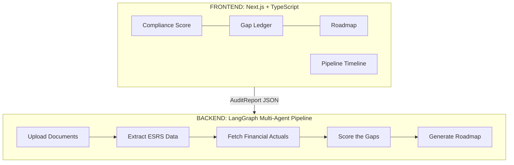

# ESRS Compliance Engine

## What This Does

European companies are now legally required to report on sustainability under the **ESRS** (European Sustainability Reporting Standards). The problem? Most companies don't know where they stand, what's missing, or how to fix it.

This product takes a company's existing reports — their financials, their sustainability claims, and their climate plans — and answers three questions:

1. **Where do you stand?** A single compliance score that shows how aligned your spending is with what you've promised.
2. **Where are the gaps?** A line-by-line audit of what you say you're doing versus what your financials show you're actually doing.
3. **How do you fix it?** A concrete roadmap to close those gaps and become fully compliant.

One upload. One audit. One clear path to compliance.

## How It Works

A company uploads three documents — their management report, their EU Taxonomy table, and their climate transition plan. AI agents read, cross-reference, and score these documents against ESRS requirements. The output is a single-page report: your compliance score, your gap ledger, and your fix-it roadmap.

## The Three Inputs

The engine needs three documents that every large EU company is already required to produce:

- **Management Report** — Contains both the audited financials (what you actually spent) and the sustainability statement (what you claim to be doing). This is the source of truth.
- **EU Taxonomy Table** — Shows exactly what percentage of your capital expenditure qualifies as "green" under EU law.
- **Climate Transition Plan** — Your roadmap for hitting net-zero, including specific targets and planned investments.

## What Comes Out

| Output | What It Tells You |
| --- | --- |
| **Compliance Score** | One number — how aligned is your spending with your sustainability promises? |
| **Gap Ledger** | Every ESRS disclosure requirement, scored for impact and financial risk, flagged by status |
| **Roadmap** | Specific actions across hardware, energy, and workload to increase your compliance score |
| **Source Trail** | Every claim traced back to the exact document and page it came from |

## Tech Stack

| Layer | Technology |
| --- | --- |
| Frontend | Next.js, TypeScript |
| Backend | LangGraph (Python) |
| LLM | Anthropic Claude |
| Contract | Typed JSON interface between frontend and backend |

## Philosophy

- **One page, one score.** No dashboard sprawl. Everything a compliance officer needs on a single screen.
- **Show your work.** Every finding links back to source documents. No black-box scores.
- **Built for regulation, not vanity metrics.** This isn't an ESG dashboard — it's an audit tool that protects companies from real fines.
