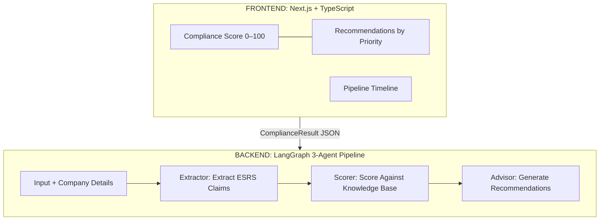

# ESRS Compliance Engine

## What This Does

European companies are now legally required to report on sustainability under **CSRD** (Corporate Sustainability Reporting Directive) using the **ESRS** (European Sustainability Reporting Standards). The problem? Most companies don't know where they stand, what's missing, or how to fix it.

This engine takes a company's Annual Management Report — or even a plain-text description of their sustainability situation — and answers two questions:

1. **Where do you stand?** A single compliance score (0–100) measuring how complete your ESRS disclosures are against what's legally required for your company size.
2. **How do you fix it?** Prioritized, actionable recommendations grouped by urgency (Critical / High / Moderate / Low) telling you exactly what to disclose next.

One input. One score. One set of recommendations.

## How It Works

A company provides their input through one of two modes, along with basic company details (headcount, revenue, total assets, reporting year). Three AI agents process the input sequentially — extracting ESRS data points, scoring disclosure completeness against a knowledge base of CSRD requirements, and generating targeted recommendations.



## Dual-Input Modes

### Structured Document (higher confidence)

Upload a pre-parsed Annual Management Report (XHTML/iXBRL converted to JSON). The single EU-mandated document contains everything — ESRS sustainability disclosures, EU Taxonomy financial data (CapEx/OpEx/Revenue), and audited financials. The Extractor reads structured iXBRL tags for high-confidence extraction, and financial context enables more specific recommendations.

### Free Text (lower confidence, same output)

Toggle a switch and paste or describe the company's sustainability situation in plain text. The Extractor does best-effort mapping of claims to ESRS standards. Same score formula, same recommendation format — just lower extraction confidence and no financial context to enrich recommendations.

Both modes also require four structured company inputs:

| Input | Purpose |
| --- | --- |
| Number of Employees | CSRD size-category threshold |
| Revenue (EUR) | CSRD applicability + fine calculation basis |
| Total Assets (EUR) | CSRD size-category threshold |
| Reporting Year | Determines phase-in schedule + applicable standards |

## What Comes Out

Both modes produce the same unified `ComplianceResult`:

| Output | What It Tells You |
| --- | --- |
| **Compliance Score** | 0–100 — how complete are your ESRS disclosures relative to what's legally required? |
| **Recommendations** | One per gap, grouped by priority tier (Critical → High → Moderate → Low), each with a specific action, rationale, and regulatory reference |
| **Pipeline Trace** | Execution timing for each of the 3 agents |

## The Three Agents

| Agent | What It Does |
| --- | --- |
| **Extractor** | Reads the input (structured iXBRL or free text) and extracts ESRS claims, company metadata, and financial context (structured mode only). Two prompt variants — one per input mode. |
| **Scorer** | Loads the ESRS knowledge base, determines the company's CSRD size category from company inputs, identifies applicable standards, and computes a disclosure completeness score (0–100). Deterministic — no LLM call needed for scoring logic. |
| **Advisor** | Reads the score and coverage gaps, generates one recommendation per missing or partial standard, assigns priority tiers, and enriches descriptions with financial figures when available. Assembles the final `ComplianceResult`. |

## ESRS Scope

The knowledge base (`master_requirements.json`) covers all ESRS standards:

| Category | Standards |
| --- | --- |
| Environmental | E1 Climate Change, E2 Pollution, E3 Water & Marine Resources, E4 Biodiversity, E5 Resource Use & Circular Economy |
| Social | S1 Own Workforce, S2 Workers in Value Chain, S3 Affected Communities, S4 Consumers & End-users |
| Governance | G1 Business Conduct |
| Cross-cutting | ESRS 1 General Requirements, ESRS 2 General Disclosures |

Which standards apply to a given company is determined dynamically based on size category and reporting year — not hardcoded.

## Tech Stack

| Layer | Technology |
| --- | --- |
| Frontend | Next.js 14, TypeScript, Tailwind CSS |
| Backend | FastAPI, LangGraph (Python) |
| LLM | Anthropic Claude |
| Knowledge Base | `master_requirements.json` — CSRD thresholds, ESRS requirements, phase-in schedules |
| Contract | Typed JSON interface (`ComplianceResult`) shared between frontend and backend |
| Streaming | Server-Sent Events (SSE) for real-time pipeline progress |

## Project Structure

```
backend/
├── main.py                    # FastAPI app + SSE endpoints
├── state.py                   # AuditState TypedDict (shared agent memory)
├── schemas.py                 # Pydantic models (mirrors TypeScript contract)
├── graph.py                   # LangGraph state machine (3-node pipeline)
├── agents/
│   ├── extractor.py           # Node 1 — ESRS data extraction (structured or free text)
│   ├── scorer.py              # Node 2 — Compliance scoring against knowledge base
│   └── advisor.py             # Node 3 — Recommendation generation
├── data/
│   └── master_requirements.json   # CSRD/ESRS knowledge base
└── tools/
    ├── report_parser.py       # JSON cleaning + iXBRL section routing
    ├── prompts.py             # Agent system prompts (3 agents × 2 modes)
    └── knowledge_base.py      # Knowledge base loader + query functions

frontend/
├── src/
│   ├── components/
│   │   ├── audit-chamber.tsx          # Main UI — mode toggle, company inputs, file upload / text area
│   │   └── compliance-result-view.tsx # Score gauge + grouped recommendations
│   ├── hooks/
│   │   └── useAuditStream.ts          # SSE streaming + mock mode state machine
│   └── lib/
│       ├── types.ts                   # TypeScript contract (ComplianceResult, etc.)
│       ├── api.ts                     # API calls (startAnalysis)
│       └── mock-data.ts              # Mock data for development
```

## Philosophy

- **One page, one score.** No dashboard sprawl. Everything a compliance officer needs on a single screen.
- **Knowledge-base-driven.** All CSRD thresholds and ESRS requirements live in a single JSON file — update regulations without changing code.
- **Built for regulation, not vanity metrics.** This isn't an ESG dashboard — it's a compliance tool that tells you exactly what's missing and how to fix it.
