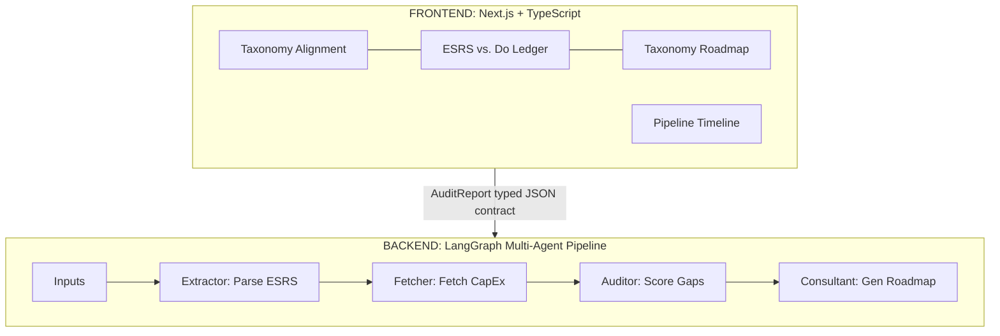

```markdown
# 🔌 EU AI Infrastructure Accountability Engine

## Scope

A B2B consulting platform that automates **CSRD (Corporate Sustainability Reporting Directive)** compliance and **EU Taxonomy** alignment for European AI infrastructure. The engine audits the gap between corporate sustainability claims and financial reality by cross-referencing mandatory **ESRS (European Sustainability Reporting Standards)** disclosures against official financial reporting to quantify the "Say-Do Gap".

The output is a single-page audit report showing the **Taxonomy Alignment Percentage** — one number that answers: *are you legally spending where you're promising?*

## Architecture



## Input Layer

The system is designed to ingest the three "Golden Sources" of truth required for a high-fidelity EU audit:

* **Integrated Management Report**: The primary corporate filing combining audited financial statements ("The Do") with the mandatory Sustainability Statement ("The Say").
* **EU Taxonomy Table**: A standardized mandatory disclosure providing the precise percentage of a company’s **CapEx** that is legally defined as "Green" under EU classification.
* **Climate Transition Plan**: The strategic roadmap mandated by **ESRS E1**, detailing specific interim targets and planned financial investments (e.g., hardware retrofits) to achieve net-zero.

## Contract-First Workflow

The frontend and backend are decoupled by a single TypeScript interface: **`AuditReport`**.

```
contracts/
├── audit-report.schema.ts   ← the typed contract (source of truth)
└── audit-report.mock.ts     ← realistic mock data for UI development

```

### AuditReport Shape (EU Updated)

| Section | Purpose | Key Fields |
| --- | --- | --- |
| `company` | Profile metadata | `name`, `ticker`, `sector`, `fiscal_year`, `registry_source` |
| `taxonomy_alignment` | Headline metric (%) | `value`, `label` (e.g., "Taxonomy Aligned") |
| `esrs_ledger[]` | Double Materiality Rows | `esrs_id`, `materiality_impact`, `financial_risk`, `status` |
| `taxonomy_roadmap` | Three-pillar roadmap | `hardware`, `power`, `workload` — each with `projected_alignment_increase` |
| `sources[]` | Consolidated citations | `document_name`, `document_type`, `registry_id` |
| `pipeline` | Agent execution timeline | `agents[]` with `name`, `duration_ms`, `status` |

## Execution Workflow

1. **User Ingestion**: The user uploads the official PDF/XHTML versions of the three required documents into the "Audit Chamber."
2. **Verification**: The system cross-references targets in the **Transition Plan** against actuals in the **Taxonomy Table**.
3. **Gap Analysis**: The system flags specific areas where current CapEx fails to support stated climate goals or ESRS requirements.
4. **Strategy**: The engine outputs a plan to reallocate budget into taxonomy-aligned infrastructure to increase compliance scores and reduce potential CSRD fines.

## Tech Stack

| Layer | Technology |
| --- | --- |
| Frontend | Next.js, TypeScript |
| Backend Orchestration | LangGraph (Python) |
| LLM | Anthropic Claude 3.5 Sonnet |
| LLM Optimization | Prompt Caching (for 100+ page reports), XML-tag processing |
| Contract | TypeScript interfaces (`contracts/`) |

## Team & Roles

* **The Architect (Agentic & Frontend)**: Responsible for the state machine orchestration, API layer, and the "Enterprise Modernist" interface.
* **The Financial Engineer (Data Lead A)**: Owns the structured financial data mapping and the logic for processing national registry filings and EU Taxonomy tables.
* **The NLP Modeler (Data Lead B)**: Owns the ESRS parsing logic, PDF chunking strategies, and the defensible "Double Materiality" scoring algorithm.

## Project Philosophy

* **Less is better.** One page, one score, one ledger, one plan. No dashboard clutter.
* **Truly agentic.** Agents use tool calling and multi-step reasoning, optimized for Claude's strengths: prompt caching, XML tags, and financial reasoning.
* **Regulatory First.** We don't just provide "scores"; we provide automated, enterprise-grade compliance that protects against CSRD regulatory fines.

`